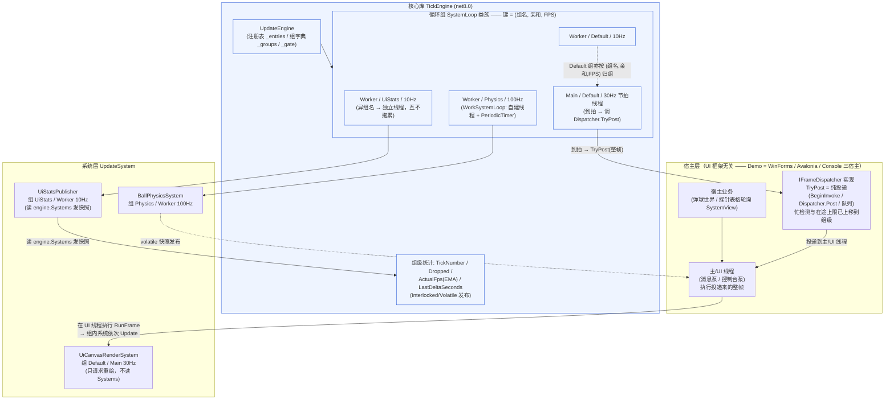
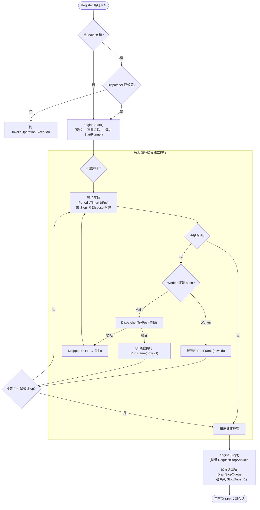
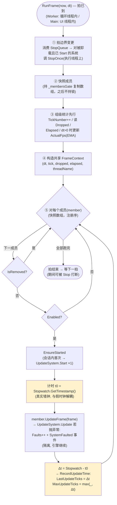

# 0002 — TickEngine 架构图与运行流程图

- 日期：2026-09（实验验证后补；组名归组已同步）
- 依据：当前实现（`src/TickEngine`）+ 决策记录 0001（Q1–Q20 语义均已落地）

Mermaid 在 GitHub / VS Code（Markdown Preview Mermaid Support）下原生渲染。
类名/方法名保留英文以对应代码，说明文字用中文。

## 〇、归组键：组名 + 亲和 + FPS

引擎按 **(组名, 线程亲和, FPS)** 归组：同组共享一条循环节拍流；**异组名可让多条同频
Worker 循环独立共存**（独立线程、独立丢拍统计）。组名默认 `"Default"`（未命名时归入；
空/空白 → Default；Trim；大小写敏感；≤32 字符）。
命名示例：`Schedule.Worker(100, "ServoA")` 与 `Schedule.Worker(100, "ServoB")`
= 两条独立的 100Hz 后台循环，互不拖累。

## 一、架构图：分层 + 线程映射

要点：
- **线程映射**：`Worker` 循环 = 引擎自建后台线程；`Main` 循环的**节拍线程只负责"到点 TryPost"**，真正的 `Update` 经 dispatcher 在 UI 线程执行（图 1 虚线投递路径）。
- **归组与共存**：组键 = (组名, 亲和, FPS)。同为 Worker 100Hz 的两个系统只要组名不同 → **两条独立循环线程**，一个睡死另一个的丢拍/帧间隔完全不受影响；此外，成员全部迁移/卸载的 Worker 组会被回收（`UpdateEngine.GroupCount` 可观察）。
- **同帧共享**：同一 (组名,亲和,FPS) 组 = 一条节拍流，组内一拍串行跑完，共享同一 `FrameContext`。
- **组级在途（v2）**：`IFrameDispatcher` 为纯投递；每组至多一帧在 UI 队列（组内 CAS 在途标志，执行完释放），多 Main 组帧并存串行执行，低频组不被饿死。

## 二、运行流程图：引擎生命周期 + 一拍主路径

要点（对应决策）：
- **丢拍不补**：Worker 迟到合并 → `Dropped++`，不补帧；`dt` 实测，系统自愈。
- **Main 组级在途（v2）**：每组至多一帧在 UI 队列（组内 CAS 在途标志，执行完释放）；
  节拍到而本组上一帧未执行完 → 本拍丢。不同组帧可并存串行执行 → 低频组不被高频组饿死。
- **拍边界**：运行中的注册/卸载/改速入队，在下一拍 `RunFrame` 开头消费。
- **Stop**：Dispose 计时器强制唤醒 `WaitForNextTickAsync` → Join（超时 = max(100ms, 2×周期+200ms)）→ 调用线程收尾。

## 三、一拍内部细节：RunFrame 放大图

要点：
- **⑤ 顺序 = 注册序（FIFO）**，先注册先跑，永不重排（Q20）。
- **计时范围**：只包 `UpdateFrame`（`Start()` 不计入）；异常路径也计入（抛异常的系统同样消耗时间）。
- **耗时字段**：`SystemView.LastUpdateSeconds / MaxUpdateSeconds`，每系统独立；探针表格「最近Update / 最大Update」两列可见，窗口自驱 **0.5s（2Hz）** 刷新。
- 丢拍/拍号/实测 FPS 是**组级**指标；耗时是**系统级**指标——表里同组多行会看到相同丢拍、不同耗时。
